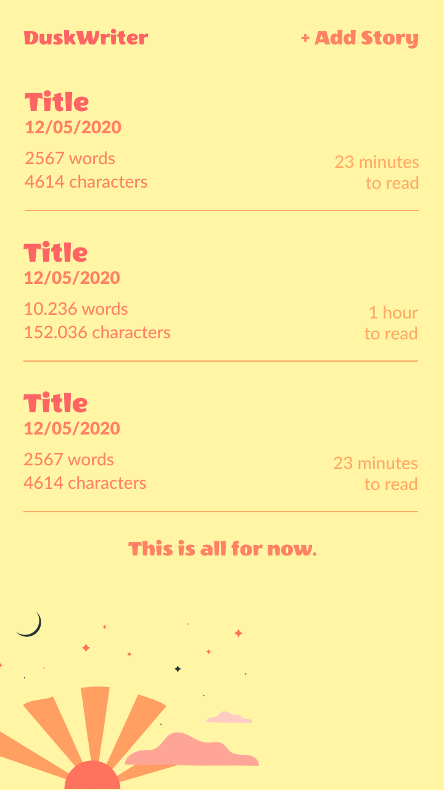
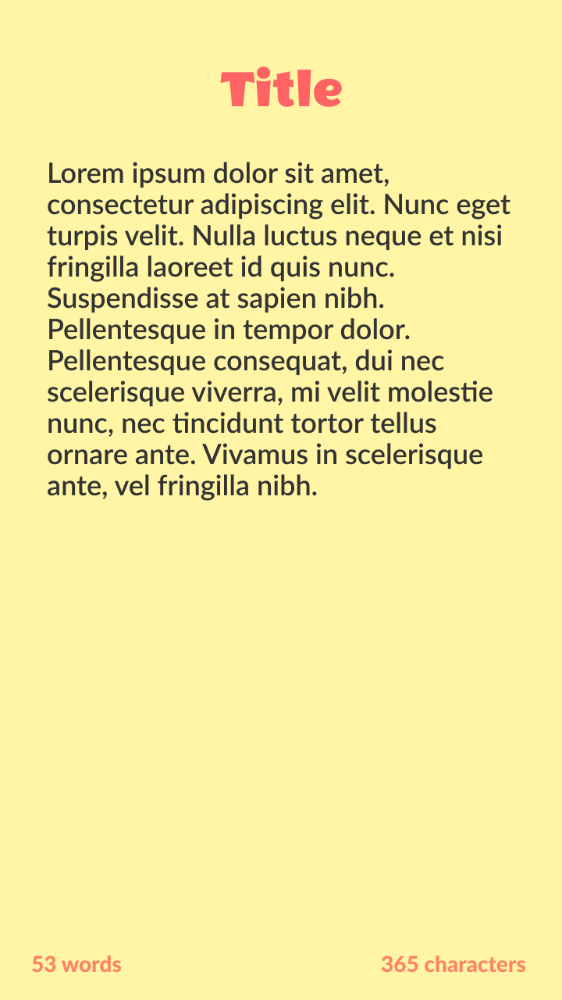

# duskwriter

## Description
Responsive Writer App Design

## Screenshots

## Commands
| Command       | Function               |
|---------------|------------------------|
| npm install   | Install dependencies   |
| npm run serve | Run development server |
| npm run build | Build for production   |
| npm run lint  | Lints and fixes files  |

### Customize configuration
See [Configuration Reference](https://cli.vuejs.org/config/).

### Potential Additions
- [x] Add Capacitor to Project
- [ ] Add Async Storage Persistence
- [ ] Use Capacitor FileSystem to save and read text files

### Resources
- [Illustrations by Freepik Stories](https://stories.freepik.com/internet)
